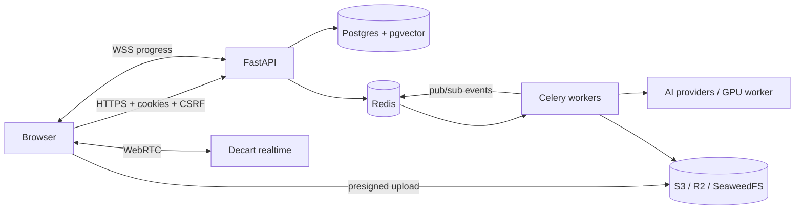

# LOOKBOOK

AI fashion designer and virtual try-on. Upload a photo, describe any outfit in plain English, and see
yourself wearing it, from a photo or live on camera. Includes an agentic AI stylist, a saved-looks
wardrobe, and an embeddable live try-on widget for online stores.

The system design is described in the LOOKBOOK technical specification. This README covers running,
testing and deploying the code; [docs/spec-differences.md](docs/spec-differences.md) lists where the code
departs from the specification.

## What's in the box

| Area | Implementation |
|---|---|
| Web client | Next.js 16 (App Router), React 19, Tailwind v4, Zustand, three.js, GSAP + Lenis |
| API gateway | FastAPI, async SQLAlchemy 2, WebSockets |
| Data | PostgreSQL 16 + pgvector, Redis 7, S3-compatible storage (S3 / R2 / SeaweedFS) |
| Workers | Celery (try-on state machine, nightly retention purge) |
| AI | Gemini (outfit interpreter, image edit, stylist, safety screening), Replicate (FLUX, IDM-VTON, CodeFormer, CLIP), Decart realtime try-on, or your own GPU worker |
| Agent | LangGraph ReAct stylist with catalogue vector search, weather, style history and style-notes tools |

Every AI provider is optional. With no keys the whole product runs in **demo mode**: simulated
generations that still go through the real queue, WebSocket, storage and database paths.



## Quick start (Docker)

Requirements: Docker Desktop (Windows/macOS) or Docker Engine + Compose.

```bash
python scripts/setup_env.py   # writes .env with generated secrets (keeps values you already set)
docker compose up --build
```

On Windows, run these in PowerShell from the repository folder with Docker Desktop running. The first
build takes several minutes. Add AI keys to `.env` later and apply them with
`docker compose up -d api worker`.

- Web: http://localhost:3000
- API docs: http://localhost:8000/docs
- S3 storage (SeaweedFS): http://localhost:8333

The `migrate` service applies database migrations, creates the bucket with its retention rules and
seeds the demo catalogue and demo store key.

## Local development (without Docker)

Requirements: Python 3.11+, Node 20+, PostgreSQL 16 with the `pgvector` extension, Redis 7.

```bash
# 1. Database roles (once)
psql -U postgres -c "CREATE ROLE lookbook_owner LOGIN PASSWORD 'owner_dev_pw'"
psql -U postgres -c "CREATE ROLE lookbook_app LOGIN PASSWORD 'app_dev_pw'"
psql -U postgres -c "CREATE DATABASE lookbook OWNER lookbook_owner"
psql -U postgres -d lookbook -c "CREATE EXTENSION vector"

# 2. Backend
cd backend
python -m venv .venv && source .venv/bin/activate   # Windows: .venv\Scripts\activate
pip install -r requirements-dev.txt
cp .env.example .env
alembic upgrade head
python -m scripts.seed_catalog
uvicorn app.main:app --reload --port 8000
celery -A app.workers.celery_app worker -Q tryon,default --pool solo   # second terminal

# 3. Frontend (third terminal)
cd frontend
cp .env.example .env.local
npm install
npm run dev
```

In development, password-reset emails are written to `backend/storage/dev-outbox/` instead of being sent.

## API keys

All keys live on the server (backend `.env`). None of them reach the browser.

| Variable | Enables | Where to get it |
|---|---|---|
| `GEMINI_API_KEY` | Outfit interpreter, photo-edit try-on (with scenes), stylist LLM, photo safety screening | https://aistudio.google.com/apikey |
| `REPLICATE_API_TOKEN` | IDM-VTON try-on, FLUX garment images, CodeFormer, CLIP embeddings | https://replicate.com/account/api-tokens |
| `DECART_API_KEY` | Live camera try-on | https://platform.decart.ai |
| `GPU_WORKER_URL` + `GPU_WORKER_TOKEN` | Your own CatVTON/IDM-VTON worker | see [docs/gpu-worker.md](docs/gpu-worker.md) |
| `TURNSTILE_SECRET_KEY` (+ `NEXT_PUBLIC_TURNSTILE_SITE_KEY` on the web app) | Bot protection on sign-up, sign-in and reset | https://dash.cloudflare.com (Turnstile) |
| `SMTP_*` | Password-reset email delivery | any SMTP provider |

After switching embedding providers, rebuild catalogue vectors with `python -m scripts.seed_catalog --reembed`.

## Tests

```bash
cd backend && python -m pytest          # 43 tests against real Postgres + Redis, S3 via moto
cd frontend && npm run lint && npx tsc --noEmit && npm run build
```

CI (`.github/workflows/ci.yml`) runs both on every push, with pgvector and Redis service containers.

## Project layout

```
backend/
  app/main.py                    app factory, middleware order, error handlers
  app/core/                      config (fail-fast in production), security, rate limits, CSRF,
                                 sessions, logging with redaction, spend caps, email, Turnstile
  app/db/                        SQLAlchemy models, engines
  app/api/v1/                    auth, media, try-on + WebSocket, stylist, catalog, looks, live, account
  app/services/pipeline/         try-on adapters: mock, gemini, replicate, remote GPU
  app/services/stylist/          LangGraph agent + tools
  app/workers/                   Celery app and tasks
  alembic/                       migrations (run as schema owner)
  scripts/                       seed_catalog, init_storage
  tests/
frontend/
  src/proxy.ts                   CSP nonce, HSTS, auth redirect, per-store frame-ancestors
  src/app/(marketing)/           landing (3D), for stores, demo store, privacy
  src/app/(auth)/                sign up, sign in, forgot, reset
  src/app/(app)/                 studio, live, stylist, wardrobe, account
  src/app/embed/                 try-on window loaded by the store widget
  src/components/three/          cloth simulation + scene
  src/stores/  src/hooks/        Zustand stores, WebSocket + presigned upload hooks
  public/widget.js               embeddable store widget
docker-compose.yml               full stack incl. SeaweedFS S3 storage and nightly backups
docs/                            security, operations, GPU worker contract
```

## Documentation

- [docs/security.md](docs/security.md): security controls and how each is enforced and tested
- [docs/operations.md](docs/operations.md): deploying, HTTPS, secrets, backups and restore, billing alerts, key rotation
- [docs/gpu-worker.md](docs/gpu-worker.md): HTTP contract for a self-hosted try-on GPU worker
- [docs/spec-differences.md](docs/spec-differences.md): where the code differs from the technical specification, and why
